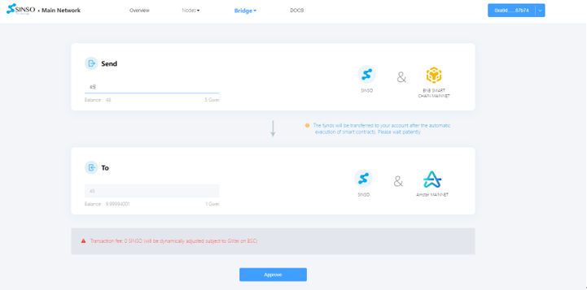

SINSO provides an asset cross-chain bridge that can receive accounts in real time, allowing users to transfer SINSO cross-chain on the BNB Smart Chain to the AMSTAR Chain mainnet, and also to transfer SINSO cross-chain on the AMSTAR Chain main network to the BNB Smart Chain main network.

1. Install Metamask. Please refer to the official Metamask website for download links: https://metamask.io
2. Add SINSO tokens in the wallet:

   Open Metamask, click "Import tokens"

Enter the contract address of SINSO token in "Token contract address": 0xc7Be6c0f9B80dD269f650514Dc9b897F3452E5ac

Click "Import tokens" to confirm the addition, and the SINSO token will be displayed in the wallet list

## Cross-chain transfer from BNB Smart Chain main network to Amstar Chain

Go to https://mainnet.sinso.io/foreign

Link the wallet, enter the number of sinso tokens to be transferred to Amstar Chain, click "Approve" to complete the signature authorization,and then click Transaction. Sign to complete the transfer. Signing requires a certain amount of BNB as a service charge. Please keep enough BNB balance in your wallet account.

Note that the transfer is automatically executed through smart contracts. The cross-chain operation is confirmed after 10 blocks. There may be a certain delay in the transfer. Please wait patiently. The minimum transfer quantity is 5 sinso.

## Cross-chain transfer from Amstar Chain main network to BNB Smart Chain

Go to https://mainnet.sinso.io/home

Link the wallet, enter the number of sinso tokens that need to be transferred to BNB Smart Chain, and click Transaction. Sign to complete the transfer.

Note that the transfer is automatically executed through the smart contract, and 5 SINSO is charged as the handling fee. The cross-chain operation is confirmed after 10 blocks. There may be a certain delay in the transfer. Please wait patiently. The minimum transfer quantity is 50 sinso.

Click Confirm

Wait patiently for the system prompt to succeed, switch to BNB Smart Chain network to view the balance

