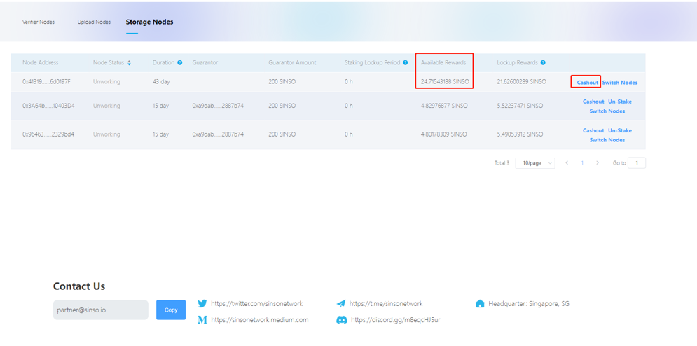

The guarantor's reward is the reward obtained from pledge.

Pledge 2000 sinso tokens required for a sinso authentication node. It needs to be transferred into pledge at one time.Sinso node builder and node guarantor will jointly distribute the income.

Pledge 10000 sinso tokens required for a sinso upload node. It needs to be transferred into pledge at one time.Sinso node builder and node guarantor will jointly distribute the income.

Pledge 200 sinso tokens required for a sinso storage node. It needs to be transferred into pledge at one time.Sinso node builder and node guarantor will jointly distribute the income.

## Award Distribution And Eeceiving

The Sinso node will send information to the verifier to prove that it works online, uploads or stores data, and has a pledge pass. The verifier will verify whether the message sent by the node is true. After the verification, the work certificate of the node will be recorded, and the cumulative score will be obtained. The node will receive its reward according to the score
The reward will be directly allocated to the wallet address of the node and the wallet address of the guarantor according to the proportion.

30% of the rewards will be released directly, and the remaining 70% will be released linearly in 18 periods, with an interval of 10 days. The direct release and linear release of the sinso pass can be obtained directly through the corresponding wallet address.

## Redemption of Pledge Currency

After pledging the node, the guarantor cannot redeem the pledge currency for a certain period (90 days). The pledge currency can only be redeemed after the lock-up period expires. This is to ensure that nodes can generate revenue normally.

## Switch Nodes

When the node pledged by the guarantor does not work offline for some reason and reaches a certain time (48 hours), the guarantor can directly switch to other nodes that work normally and continue to generate guarantee income.
