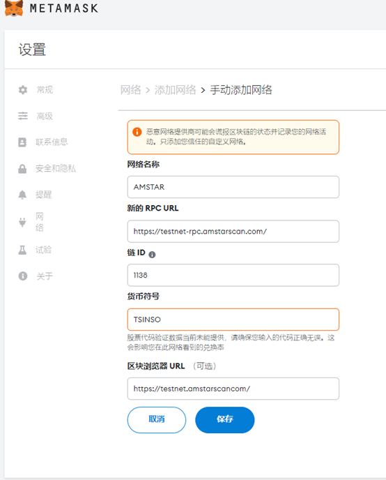

The SINSO distributed cache test network is built on the Amstar test network,
so you must use the SINSO of the test network to fund your nodes.

## How to receive SINSO from AMSTART test network

Amstar test network faucet URL： https://faucet-testnet.amstarscan.com/

## How to receive the Staging Token SINSO node from the SINSO test network？

At present, the SINSO test network is open to all users.

Users can download the corresponding sinso mining program, and then after starting the node according to the tutorial, they can get the test pledge currency of the corresponding node. Currently, only the authorization signature for connecting to the Metamask wallet is supported (the Metamask plug-in needs to be connected to the PC to receive)

SINSO pledge browser：https://testnet.sinso.io/

Tips:

Click to download Chrome browser:

https://www.google.com/intl/en-US/chrome/browser-features/#extensions

Metamask Plug in download address:

https://chrome.google.com/webstore/search/metamask?hl=en

# Add amstar network

Chain Name：AMSTAR TEST

PRC URL:

https://testnet-rpc.amstarscan.com/

Chain ID:1138

Coin Symbol: SINSO

Browser：https://testnet.amstarscan.com/

<!--  -->
