To install the SINSO node, you need to complete the following steps:

1. Install SINSO GUI mining program

2. Set configuration

3. Run SINSO GUI mining program

4. Add SINSO node

5. The gas cost of using SINSO as a node and its interaction with the main network.

6. NAT address

7. Start the SINSO node and check whether your SINSO node works normally

## Install SINSO

Currently supported systems:

1. Ubuntu desktop 20.04

   https://ubuntu.com/#download

2. Windows 10

3. Mac (Intel based)

# Download Address

You can click the following link to access the Quick Installer. exe file：

Ubuntu 20.04 :

https://github.com/sinsoio/sinso-mine-ui/releases/download/v0.0.2/mine-ui-ubuntu-amd64.tar.gz

Windows 10 :

https://github.com/sinsoio/sinso-mine-ui/releases/download/v0.0.2/mine-ui-windows-amd64.tar.gz

Mac (based on Intel processor)：

https://github.com/sinsoio/sinso-mine-ui/releases/download/v0.0.2/mine-ui-mac-intel.tar.gz

## Configure sinso

When you start sinso for the first time, you need to configure it to meet your needs.

Edit configuration information

1. Node management account

Helps you query the nodes you created when pledging nodes. It also provides gas for the nodes you create

2. Node startup password

Helps you start node authentication security and export private keys. This password program will not be saved for you. Please backup it yourself. If it is lost, we can't help you find it

3. Data storage directory

Sinso is decentralized storage, so you need to set your data storage directory. The minimum shall not be less than 100g.

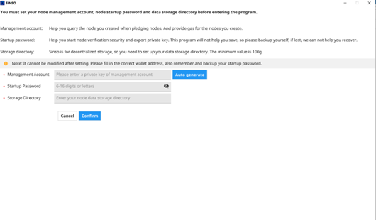

## Run sinso

After the SINSO configuration is completed, the performance of your device running sinso will be displayed, which will directly affect the number of sinso nodes that your device can set.

## Add sinso node

You can directly enter a number less than or equal to the system prompt, and then click Auto Generate

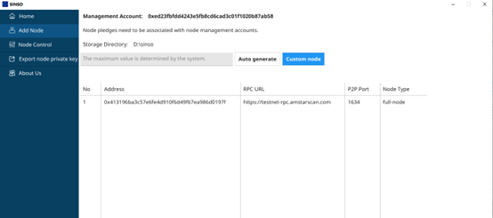

Of course, you can also configure your sinso node manually

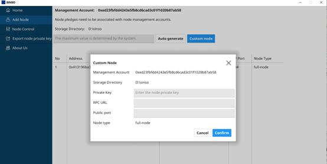

## Support your node

After the sinso node is configured, you need to provide funds for your node before the next sinso node is started. SINSO is the consumption of gas on the Amstar chain.

You need to transfer an appropriate amount of sinso tokens for your node through the node management address. Each node cannot be less than 0.5 sinso.

Tip: The sinso token on the main chain of Amstar (please refer to the cross-chain bridge)

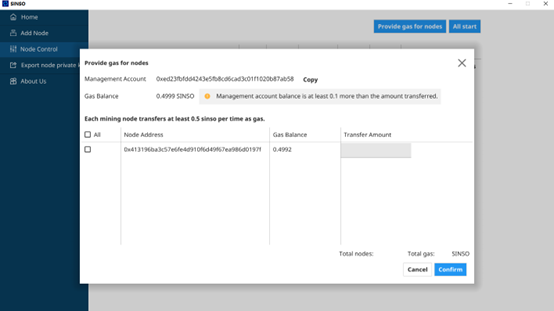

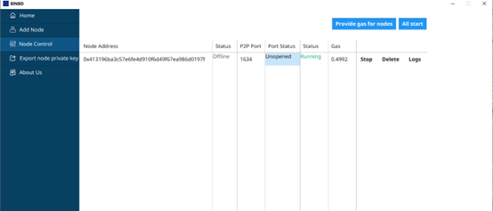

## NAT address

The Sinso incentive network is about sharing and storing data. To enable other nodes to connect to your node, you must broadcast your public IP address and ensure that you can access the node on the correct p2p port. We recommend that you manually configure your external IP and check the connection to ensure that your node can receive connections from other nodes.

You can check whether your node's Internet port is open through the UI interface

1 First enter the node password to start the node

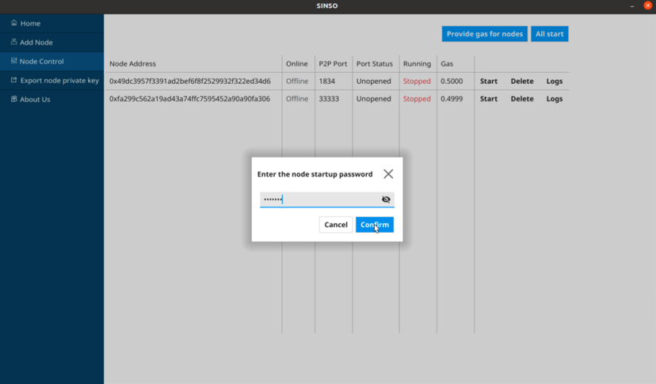

2 Wait for the system to automatically detect and start

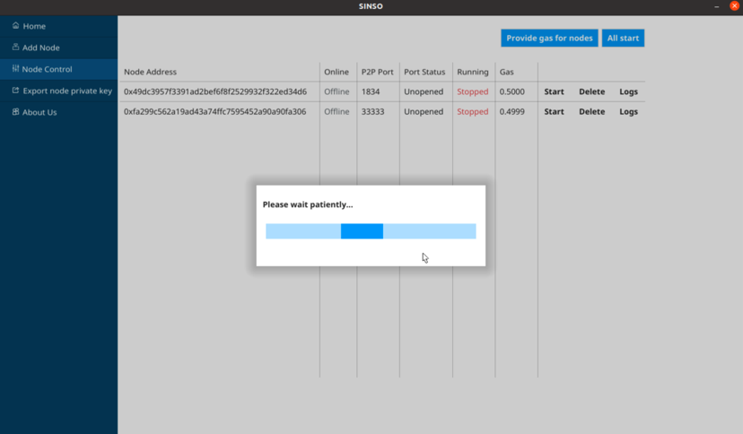

If your internet port is not open, the system will prompt you to open your internet port before starting it.

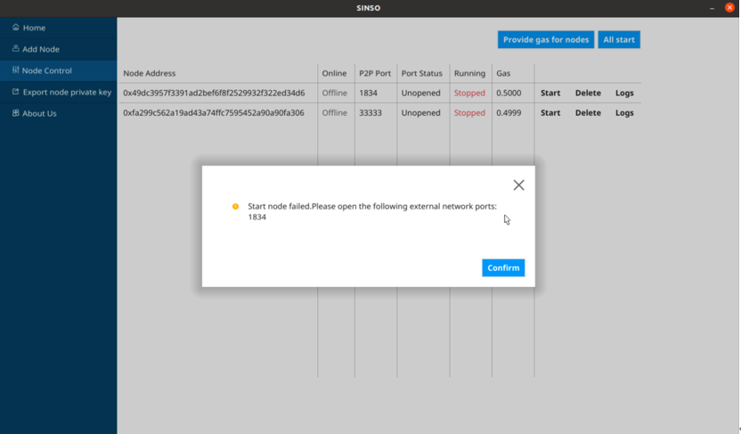

If the Internet port is opened, the program will run normally, and the status displays Running,

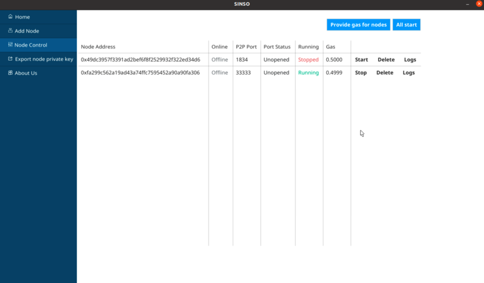

After that, the port status will also display opened

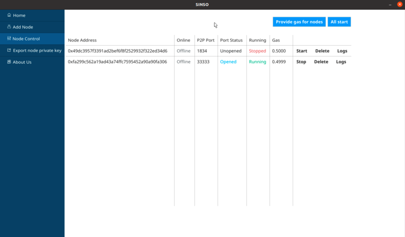

3. After the program runs, the system will start to synchronize blocks. Please wait patiently. You can click "Log" to view

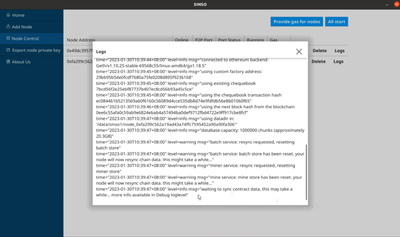

After synchronization, your node will display "online" status

After the above steps are completed successfully, your node will start to work normally

## Join New Sinso

If everything goes well, you will see that your node is officially working, and the external network interface is smooth and running normally.

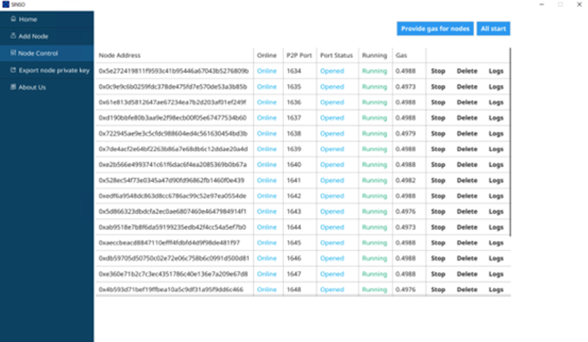

Now your node will start to request the data block that belongs to you -- then you will provide data to other p2p clients running in SINSO. Next, your node will begin to respond to requests from other nodes for these blocks, and you will soon be rewarded in SINSO.

## Warning

When you run SINSO for the first time, you will be asked to automatically create or import the node management address. If you are importing, you need to import the private key of the address. never mind. Because SINSO is a decentralized network, there will be no centralized processing to steal your private key. The same is true when adding nodes manually.

## Pledge reward

Each node must have a guarantor to pledge the node, so that the node can get the reward smoothly. The guarantor can pledge the node through the pledge browser. The pledged wallet address cannot be the same as the running node address, otherwise it cannot be pledged.

SINSO will call the workload certification contract every hour to check whether you are online, whether the data blocks of the whole network are stored, and whether the node has a pledge currency. If all requirements are met, you will receive corresponding workload rewards.

## Blockchain RPC endpoint

Your sinso node must be able to stably access the amstar Chain RPC endpoint so that it can interact and deploy with your node. Our system will automatically assign amstar Chain RPC endpoints without manual configuration

## Upgrade sinso

Go directly to the About Us interface and click Check for Updates. The system will prompt you whether it is the latest version. If not, you can click to download the update

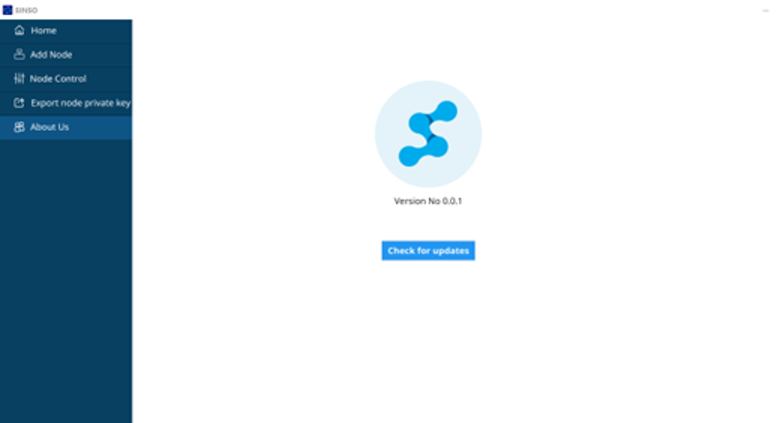
