## . Miners Guaranteeing their Own Nodes

To stake a node, you must hold the official SINSO token of the AmStar chain. (Reminder, if you hold official tokens on the BSC chain, you need to convert them through the cross-chain bridge, check the cross-chain bridge operation tutorial for details)

## 1.Find nodes

Enter the node-staking interface of the SINSO Network Page, click the button for one-click guarantee, a pop-up window will appear, `enter your own node management account`, click search, and the SINSO mining node you built will be displayed, then enter the name of the mining node you want to stake. The system automatically calculates the SINSO tokens that need to be staked.

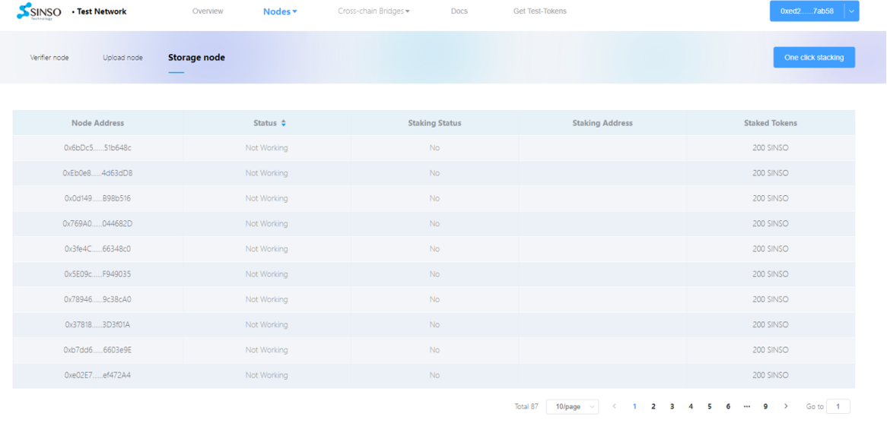

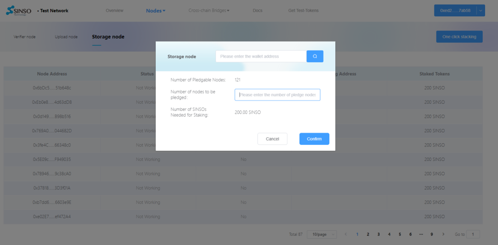

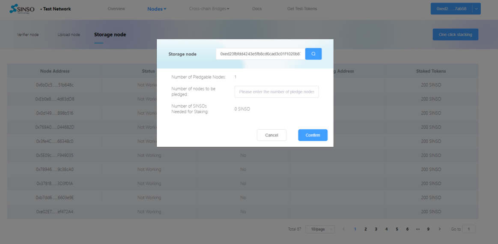

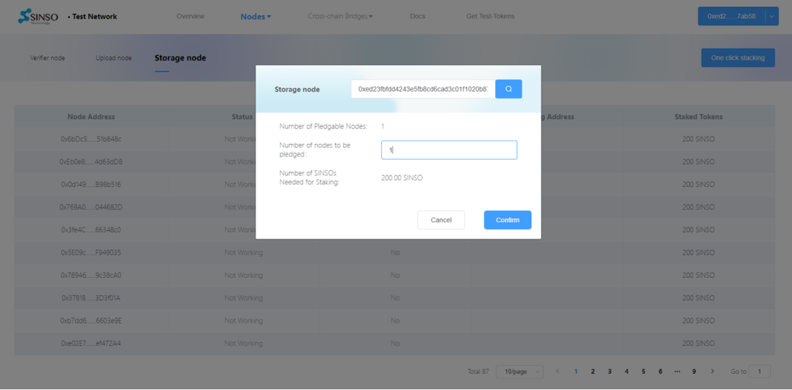

## 2.Confirm node

Click confirm, the system automatically screens out the corresponding number of mining nodes, the user needs to confirms again.

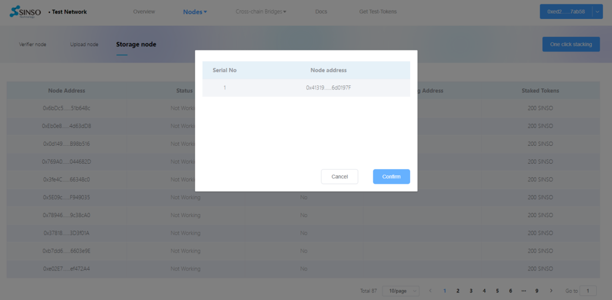

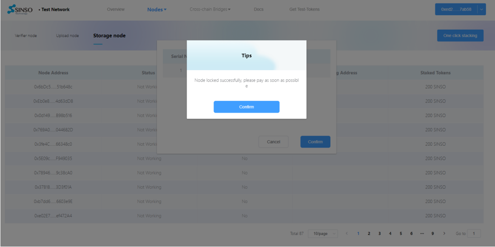

## 3.Pledge node

Connect your wallet (any wallet address other than your working node address can be staked), and ensure that there are enough SINSO tokens for the number of staked SINSO mining nodes. The transaction is signed and confirmed, then the pledge will be completed.

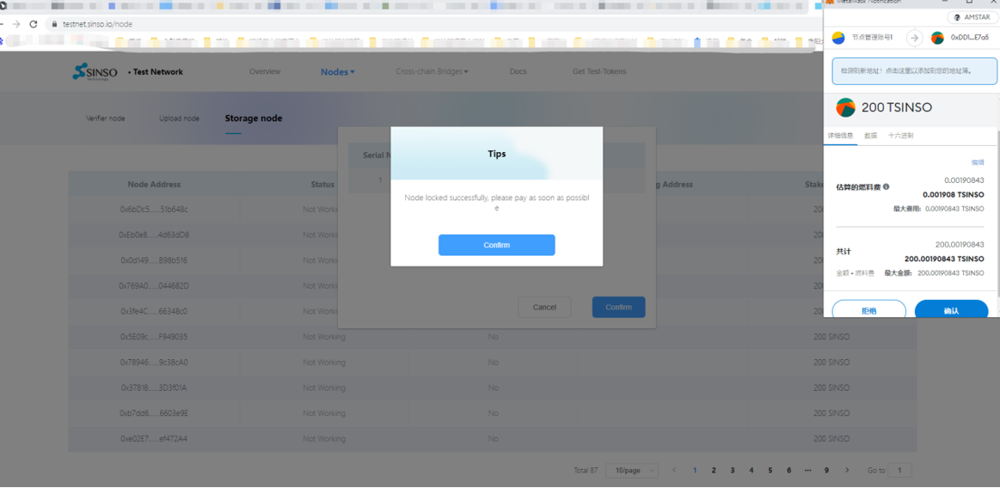

## 4.View pledged nodes

Enter the “My Node” section, connect the wallet address you used for staking SINSO tokens, and the system will automatically display the pledged node information under that specific address.

`Cashable Rewards`: refer to the SINSO tokens that can be withdrawn directly to the wallet

`Lock-up Reward`: refers to the unreleased SINSO token reward

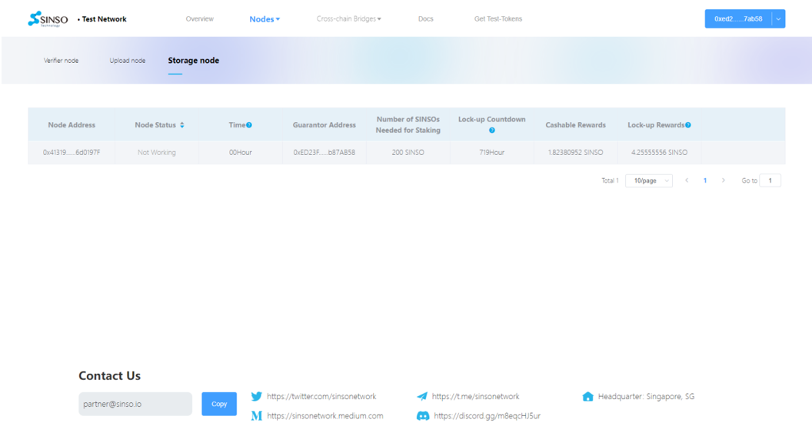

## 5.Checking Node Rewards

Enter the "my node” section, enter your node management wallet address, and the system will display the node information connected to that address.

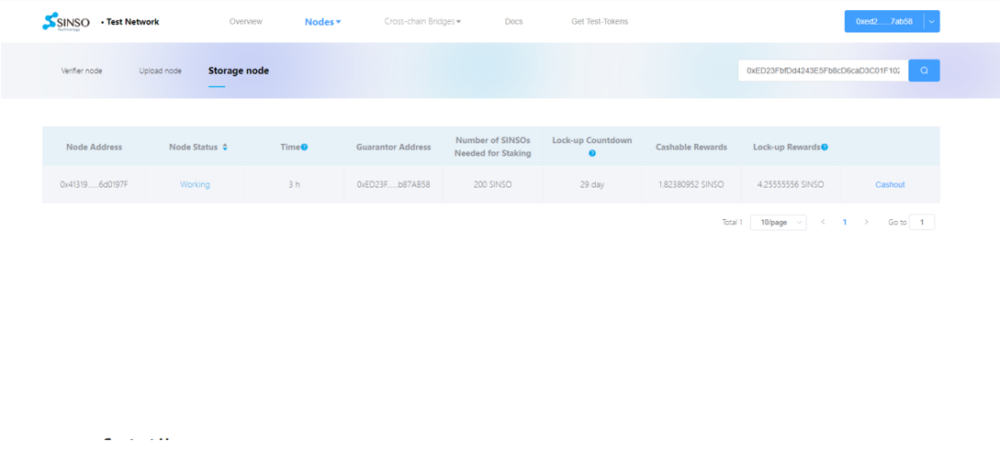

## 6. Collecting Node Rewards

After selecting "My Node", enter your node management address, click Search to query the node connected to that address.

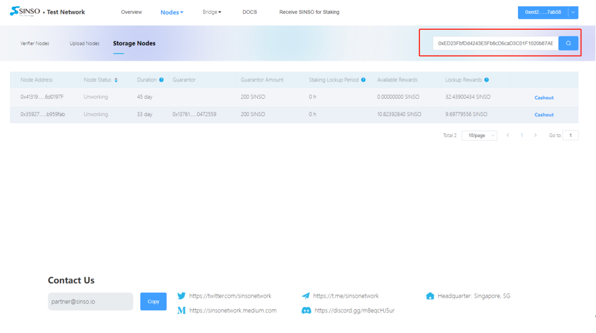

Click “Cashout”

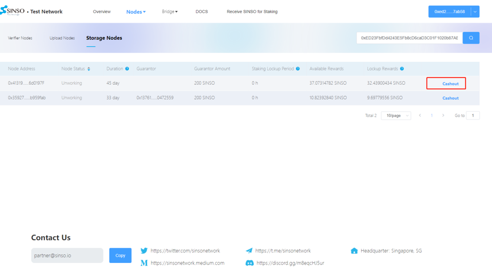

Click “Confirm” after confirming the amount

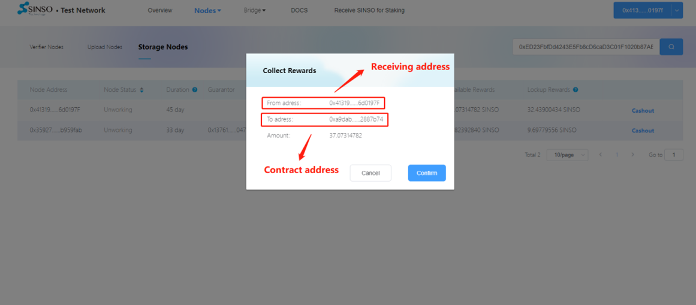

Note that the address for receiving rewards needs to be consistent with your node address, because a signature is required

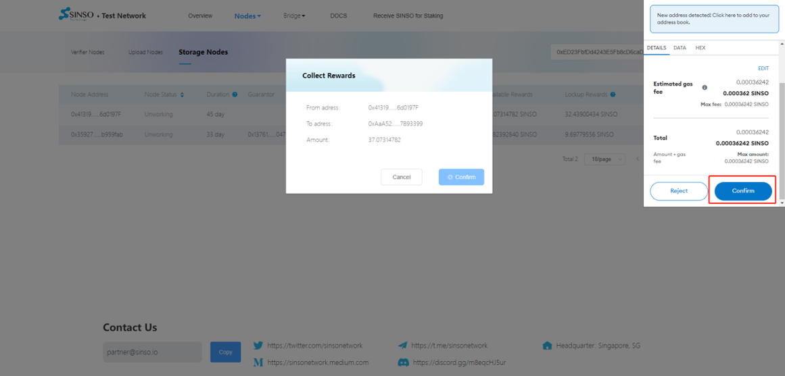

Click and sign, the system will show that the transaction went through successfully, check the wallet to make sure the earnings have arrived.

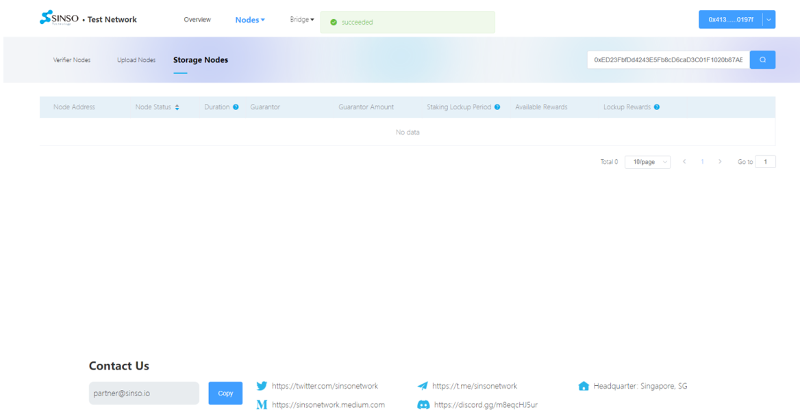

## 7.Guarantor Receiving Rewards

After selecting "My Staking", connect your guarantor's wallet address, the system will display the node you pledged, and the income of the node, as well as other informations.

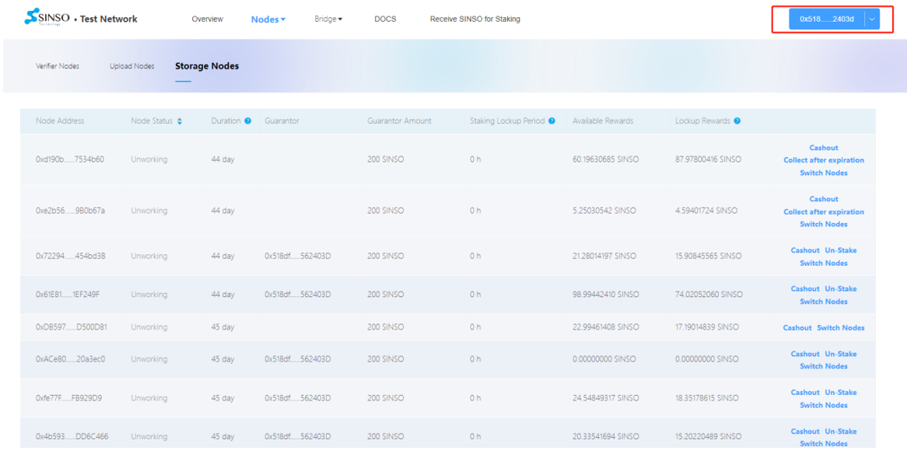

Click “Cashout”

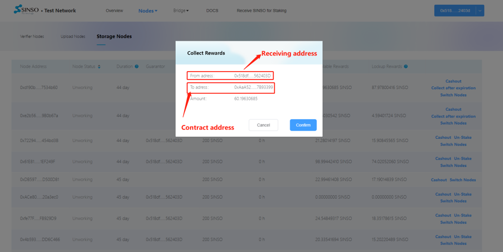

After confirming the amount, click “Confirm” on both the website as well as on your wallet and wait for the signing page on your wallet

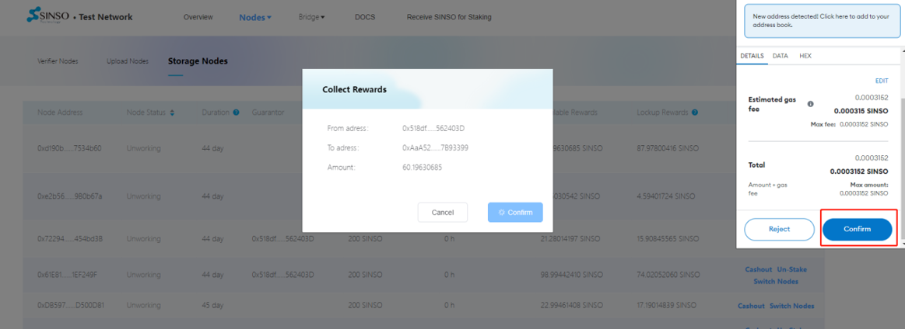

After Signing, wait for the transaction to be approved, once succeeded, check your wallet to make sure the earnings have arrived in your account
