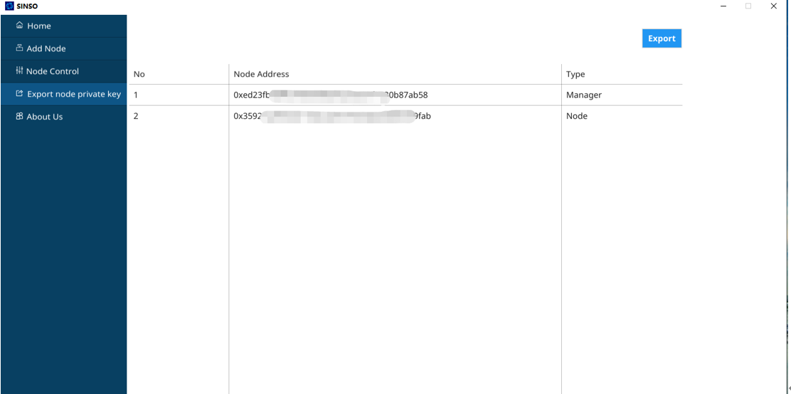
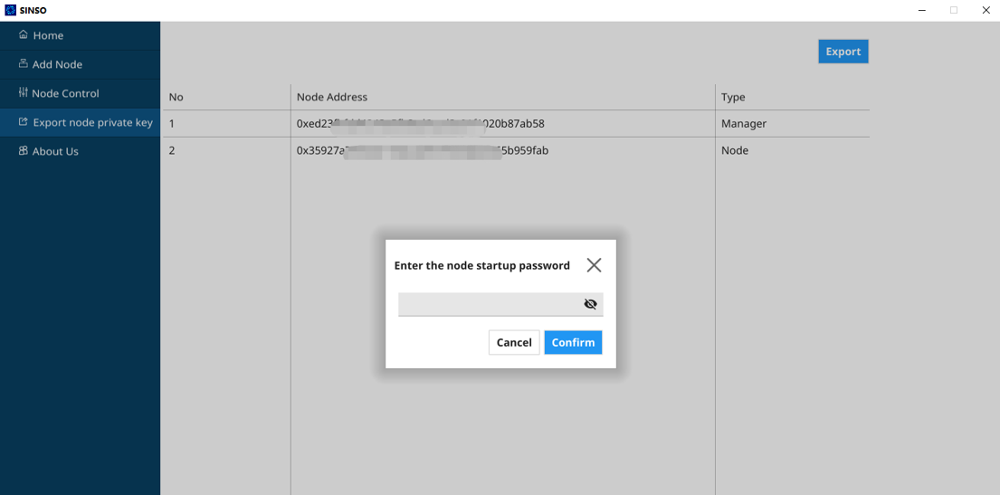
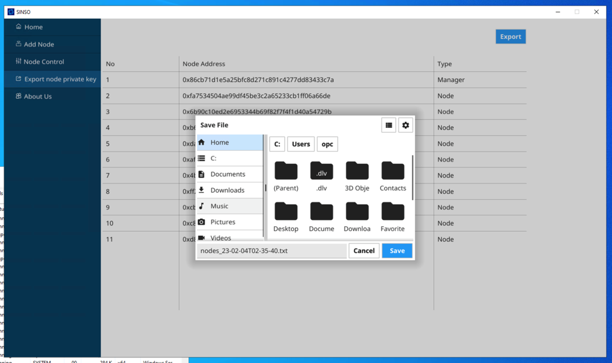
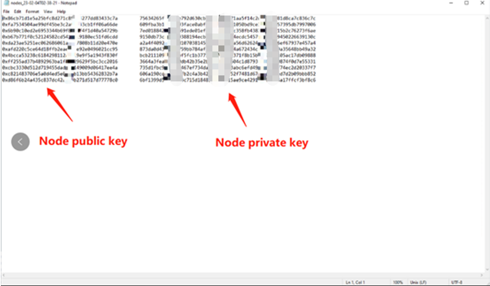

## Connectivity

Which p2p port does sinso use and which should I open in my router?

The default p2p port for sinso in 1634, please forward this using your router and allow traffic over your firewall as necessary.

https://docs.sinso.io/docs/general/connectivity

## How to export the node private key from the installed Sinso-GUI program

If you need to receive your node rewards, you must use the corresponding address of the node for signature verification, so you must export the private key of the node address in the program, then import it into your Metamask wallet, and connect to the website to claim it.

1. click button "Export"

2. Enter the node startup password

3. Select the path you want to save, the program will automatically generate an exported private key file, click the button:"Save"

4. Find the corresponding path, open the document to view your backup private key

## How to import SINSO node address to MetaMask?

1. export your sinso node private keys
2. go to Metamask and click import account
3. choose select type: Private key
4. paste the Private key
5. click Import

## Node management address

Can I use the node management wallet address to pledge the node I built?

Yes, as long as the pledge node address does not duplicate the node address you built, it will be more convenient for you to manage and query by using the node management wallet address to pledge your node.

## guarantee

Can I be a guarantor without building a sinso node?

Yes, as long as you have the sinso token, you can become the guarantor of our sinso network node. Directly participate in node pledge and get pledge rewards.
