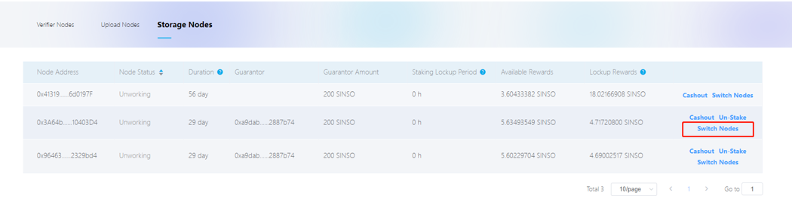
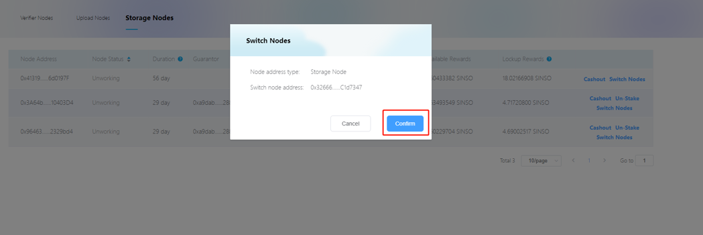
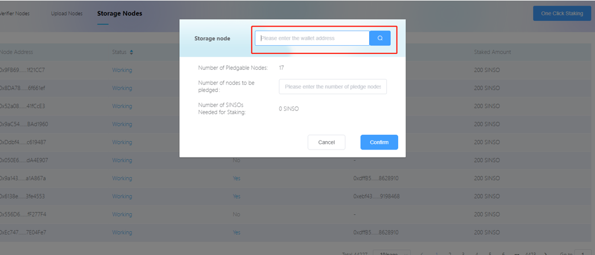

## As a guarantor, I pledge miner nodes, how many nodes can I pledge at one time?

The number of pledged nodes cannot exceed 20 each time, because you will also consume resources on the chain when you pledge, and excessive one-time consumption will affect data writing.

## What's the matter if the online time of the node I pledged is longer or shorter?

The longer the working node is online, it represents the hardware equipment and the better the network, the more profitable and stable the node will be.

## My staked node is offline, what should I do?

If the node is offline for 48 hours, then we will punish this type of node, because the node offline will also affect the guarantor's income. If you really encounter this situation, you don't need to worry too much, because the system will help you switch to Normal working nodes to ensure that you will continue to generate income when you invest in pledged coins.

1. View your staked node online

2. If a node that is offline for more than 48 hours is found, the "Switch Nodes" button will appear in the operation bar

3. Click the button "Switch Nodes" system will help you switch to a normal working node

## When I stake a node, can I choose whose node to stake?

Yes, you can, when you pledge, enter the account address of the management node that needs to pledge the node address in the input box, and you can search for the node address you want to pledge, and then you can pledge to the node you want to pledge.

